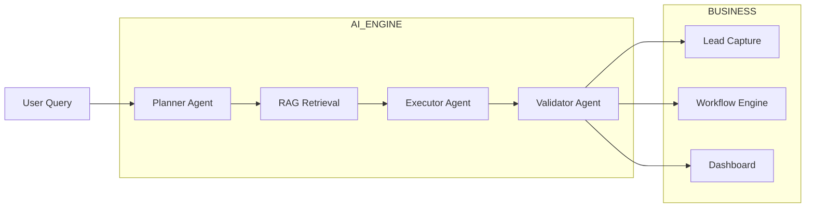

<h1 align="center">🧠 Smart AI Business Assistant</h1>
<h3 align="center">⚡ Multi-Agent AI Platform for Customer Support, Lead Capture & Workflow Automation</h3>

<p align="center">
  
  
  
  
</p>

<p align="center">
  <b>💬 Assist • 🎯 Capture Leads • 📚 Retrieve Knowledge • ⚙️ Automate Workflows</b>
</p>

---

## 🧠 What is Smart AI Business Assistant?

> A production-oriented **AI platform for SMEs** that combines:

- Conversational AI  
- RAG-powered knowledge retrieval  
- Lead management  
- Workflow automation  
- Multi-agent orchestration  

👉 Designed as an intelligent business operating system.

---

## ⚙️ System Architecture



---

## 🤖 Core AI Capabilities

### 📚 RAG-Powered Knowledge Retrieval
- Semantic chunking
- ChromaDB vector search
- Lexical fallback retrieval
- Grounded responses with source awareness

---

### 🧠 Multi-Agent Orchestration
Three-agent pipeline:

```text
Planner → Executor → Validator
```

- Planner decides strategy
- Executor generates response
- Validator scores confidence & quality

---

### 💬 Conversational Memory
- Short-term conversation history
- Long-term user preference memory
- Personalized interactions

---

### 🎯 Lead Capture System
Automatically extracts:
- Name
- Email
- Phone
- Company

Then classifies leads:
- 🔥 Hot
- 🌤 Warm
- ❄ Cold

---

### ⚙️ Workflow Automation
Built-in workflows:

- 📧 Email summarization
- 📊 CRM sync
- 📅 Calendar booking

---

## 🖥️ Admin Dashboard

The platform includes a complete operational dashboard:

| Module | Purpose |
|------|---------|
| Assistant | Multi-turn AI chat |
| Leads | Lead management |
| Documents | Knowledge base |
| Workflows | Automation control |
| Analytics | Metrics & monitoring |

---

## 📂 Project Structure

```text
app/
├── api/            # REST endpoints
├── core/           # config + security + DB
├── services/       # AI, RAG, workflows
├── static/         # frontend assets
└── templates/      # dashboard UI
```

---

## 🚀 Quick Start

### Local Setup

```bash
python -m venv .venv
pip install -r requirements.txt
copy .env.example .env
```

### Start Server

```bash
python -m uvicorn app.main:app --reload
```

👉 Open:
```text
http://127.0.0.1:8000
```

---

## 🐳 Docker Deployment

```bash
docker compose up --build
```

---

## 🔑 Demo Credentials

```text
Email: admin@example.com
Password: admin123
```

---

## 🛠️ Tech Stack

| Layer | Technology |
|------|-------------|
| Backend | FastAPI |
| AI Orchestration | LangChain-style agents |
| Vector Store | ChromaDB |
| Cache | Redis |
| Database | SQLite |
| Auth | JWT |
| Deployment | Docker |

---

## 🎯 Key Features

✔ Multi-agent orchestration  
✔ RAG with vector retrieval  
✔ Conversational memory  
✔ Lead intelligence system  
✔ Workflow automation  
✔ Admin analytics dashboard  

---

## 🔥 What Makes This Different

Most AI chat apps:
❌ Just answer questions  

This system:
✅ Operates like a **business assistant platform**

---

## 🔮 Future Improvements

🚀 PostgreSQL + scalable vector DB  
🧠 Real LLM providers  
📱 WhatsApp integration  
📊 Advanced analytics  
🌐 Cloud deployment  

---

## 💡 Philosophy

> “AI should not just respond —  
> it should operate.”

---

<p align="center">
  🧠 Smart AI Business Assistant — Building AI Systems for Real Businesses
</p>
